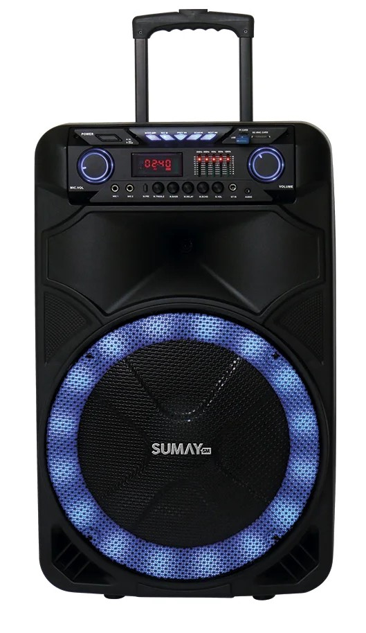
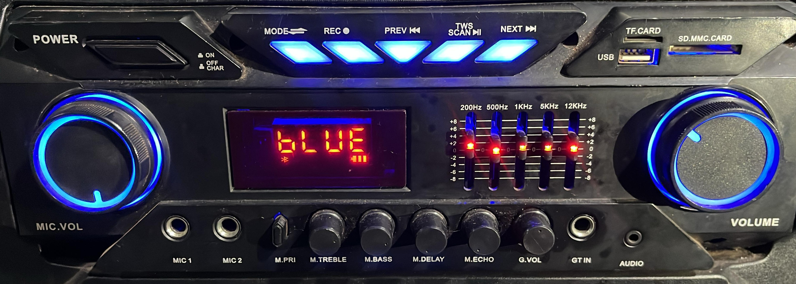

  

---

## Painel 

  

---

## Botões:

1. Liga/desliga (*Power*)
2. Modo (*line*, *bluetooth*, rádio)
3. Gravação (*REC*)
4. Voltar a música (*Preview*)
5. Pause/modo *TWS*
6. Próxima música (*Next*)

Na direita temos entradas USB, Cartão de memória.

Temos dois controles de volume um na esquerda (**MIC. VOL**) e um na direita (**Volume**)

- MIC. VOL - controla volume do microfone
- Volume - controla volume da música 

No meio temos um painel de *led*

---

## Equalizador

Temos um equalizador de 5 faixas, começando em 200Hz e indo até 12KHz, recomendado deixar tudo no meio, para não desbalancear.

- 200Hz: Controla os graves 
- 500Hz: Região dos médios-graves 
- 1KKz: Médios
- 5KHz: Médios-agudos
- 12KHz: Agudos

---

## Parte inferior

- MIC 1 - Entrada para microfone de fio
- MIC 2 - Entrada para microfone de fio
- M. PRI - Prioridade do microfone, caso esteja ativado, o microfone se torna prioridade e abaixa a música.
- M. TREBLE - Agudo do microfone
- M. BASS - Grave do microfone
- M. DELAY - Delay do microfone 
- M. ECHO - Eco do microfone
- G. VOL - Volume da entrada de Guitarra (como se fosse uma entrada de microfone)
- GT IN - Entrada para Guitarra
- AUDIO - Entrada P2, para cabos auxiliares

---

## M. TREBLE (Microphone Treble)

Controla o agudo do microfone

Se a voz estiver muito fina/estridente:

- Aumente o ***BASS*** para deixar a voz mais encorpada
- Diminuia o ***TREBLE*** para suavizar os agudos

---

## M. BASS (Microphone Bass)

Controla o grave do microfone

Se a voz estiver muito abafada/pesada:

- Aumente o ***TREBLE*** para dar mais clareza
- Diminuia o ***BASS*** se os graves estiverem exagerados

---