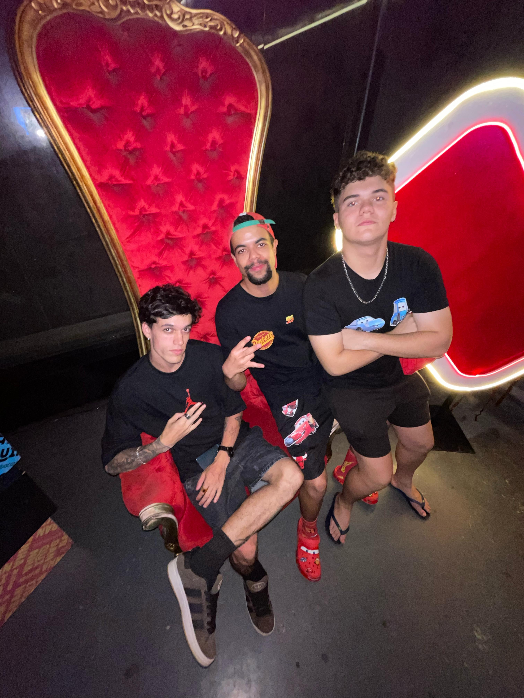
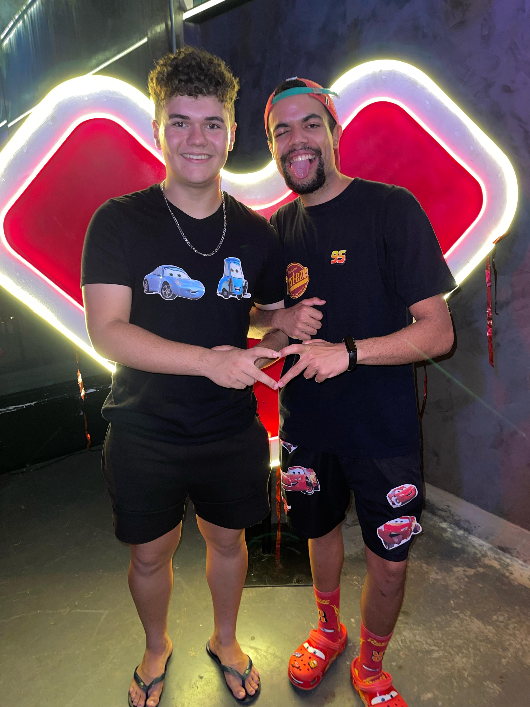

# Um Novo Amor

Sabe aquele amigo que sempre esteve por perto, compartilhando risadas, confidências e até algumas aventuras? Pois é, recentemente ele foi surpreendido por algo que muda tudo: se apaixonou. E não foi uma paixão qualquer, dessas passageiras, mas sim aquela que faz brilhar os olhos e muda o jeito de falar sobre o futuro.

---

  

---

De repente, as conversas mudaram. Agora, entre um jogo e outro, ele fala sobre mensagens trocadas, encontros marcados e planos para o fim de semana. O sorriso ficou mais fácil, a ansiedade virou borboleta no estômago e até as músicas ganharam outro sentido.

Nós, amigos, estamos felizes por ver essa transformação. É bonito acompanhar alguém descobrindo um novo sentimento, se permitindo viver algo intenso e verdadeiro. Que esse amor traga ainda mais alegria, aprendizado e momentos inesquecíveis.

Lembre-se, amigo: aproveite cada instante, mas não esqueça de quem sempre esteve ao seu lado. O coração pode crescer e sempre cabe mais amizade e carinho.

---

  

Nós estamos orgulhosos amigo, vai dar td certo, aproveite demais, porém não nos abandone, não esqueça os amigos!

---